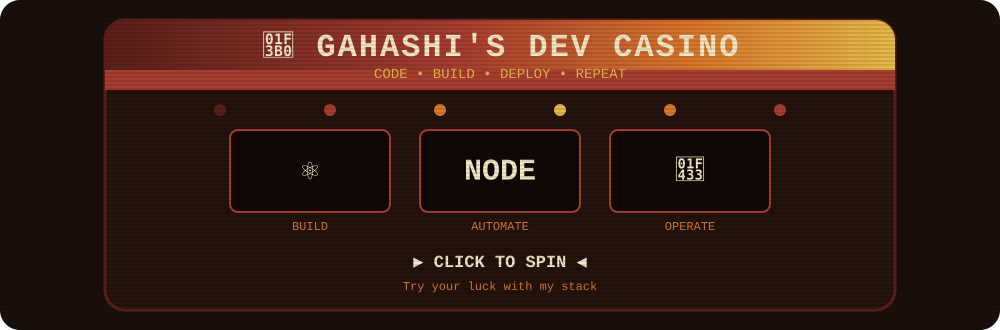

<!--
VHS / RETRO PALETTE

Dark:    #1A0F0A
Wine:    #5A1F1A
Red:     #A63D2F
Orange:  #D9772B
Yellow:  #E5B94A
Cream:   #F4E7C5
-->


<div align="center">

[](https://github.com/gahashi)
[](mailto:gabrielbritotody@gmail.com)

</div>

---

```text
gahashi@dev:~$ whoami

Software Developer since 2022
Full Stack • Systems • Automation • Infrastructure
Computer Science @ UNIVALI
```

---

## `01 / engineering`

<table>
<tr>

<td width="33%" valign="top">

<h3 align="center">BUILD</h3>

<p align="center">
Aplicações, interfaces e sistemas completos.
</p>

<p align="center">


</p>

</td>

<td width="33%" valign="top">

<h3 align="center">AUTOMATE</h3>

<p align="center">
Integrações, automações e processamento assíncrono.
</p>

<p align="center">


</p>

</td>

<td width="33%" valign="top">

<h3 align="center">OPERATE</h3>

<p align="center">
Containers, servidores e ambientes de desenvolvimento.
</p>

<p align="center">


</p>

</td>

</tr>
</table>

---

## `02 / current work`

<table>
<tr>

<td width="64%" valign="top">

<h3>Brava Pass</h3>

<p>
<strong>SaaS para o ecossistema universitário</strong>
</p>

<p>


</p>

<p>
Plataforma desenvolvida para centralizar a gestão de entidades universitárias,
membros, permissões, produtos e serviços.
</p>

<p>
O projeto envolve autenticação, autorização baseada em escopo,
verificação de e-mail, armazenamento de arquivos, migrations,
seeds e integração com meios de pagamento.
</p>

<p>
<strong>Stack</strong>
</p>

<p>


</p>

</td>

<td width="36%" valign="top">

<h3>Current focus</h3>

<pre>
architecture
├─ authentication
├─ authorization
├─ relational data
├─ file storage
├─ payments
└─ infrastructure
</pre>

<p>
<strong>Working with</strong>
</p>

<p>
<code>Next.js 16</code><br><br>
<code>React 19</code><br><br>
<code>TypeScript</code><br><br>
<code>Prisma</code><br><br>
<code>MariaDB</code><br><br>
<code>Docker</code><br><br>
<code>Linux</code>
</p>

</td>

</tr>
</table>

<br>

<table>
<tr>

<td width="64%" valign="top">

<h3>Automation Engine</h3>

<p>
<strong>Processamento assíncrono e automação de navegador</strong>
</p>

<p>


</p>

<p>
Arquitetura desacoplada para execução de tarefas assíncronas
com filas, prioridades, múltiplas tentativas, estados de execução
e callbacks entre sistemas.
</p>

<p>
Utilizada para automação de navegador, autenticação,
buscas, coleta e processamento de dados.
</p>

<p>
<strong>Stack</strong>
</p>

<p>


</p>

</td>

<td width="36%" valign="top">

<h3>Job lifecycle</h3>

<pre>
request
   ↓
queue
   ↓
worker
   ↓
browser
   ↓
processing
   ↓
callback
</pre>

<p>
<strong>Concepts</strong>
</p>

<p>
<code>queues</code><br><br>
<code>retries</code><br><br>
<code>priorities</code><br><br>
<code>workers</code><br><br>
<code>callbacks</code><br><br>
<code>automation</code>
</p>

</td>

</tr>
</table>

---

<div align="center">

`BUILD` → `AUTOMATE` → `OPERATE`

</div>

---

## `03 / dev casino`

<div align="center">

### 🎰 Feeling lucky?

Minha stack também aceita apostas.

**👇 Clique na máquina para girar 👇**

<br>

<a href="https://gahashi.github.io/gahashi/casino/">
  
</a>

<br>

<sub>
🎰 ⚛️ React · ▲ Next.js · 🟦 TypeScript · 🟢 Node.js · 🐘 PHP · 🐳 Docker · 🐧 Linux
</sub>

<br><br>

<a href="https://gahashi.github.io/gahashi/casino/">
  
</a>

</div>